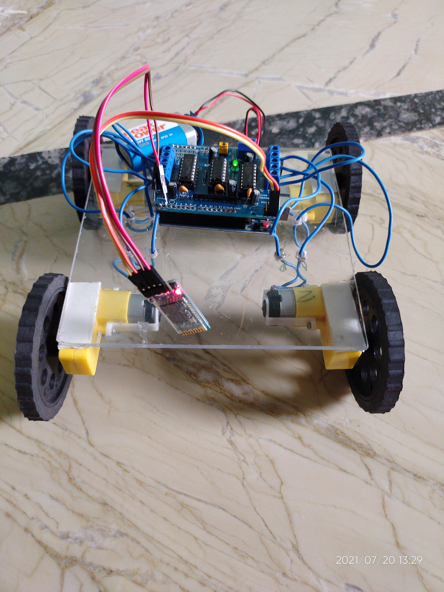
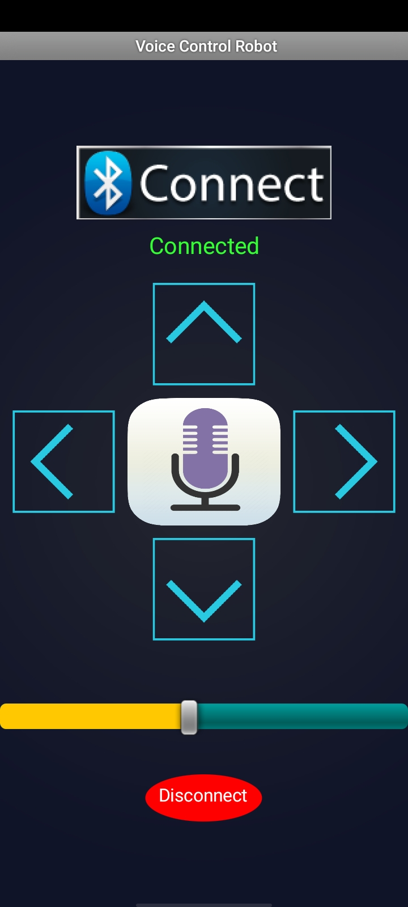

# 🚗 Voice-Control-IOT-Car 🚗
  

## Description ➕

Voice Control the IoT car is a hardware project in which car movement can be controlled by a simple mobile application made on MIT App Inventor.  

# Requirements:
1. Arduino Uno
2. L293d Motor Shield
3. 4 DC Motor ⚙️
4. 9V Battery 
5. Female to Female jumper Wires,
6. Simple wires

# Pictures of Car and App

 

 

## 🛠️ 🧰
## Built with ❤️

Credits: <l>https://create.arduino.cc/projecthub/embeddedlab786/voice-control-robot-f9560b?ref=similar&ref_id=361615&offset=2</l>
